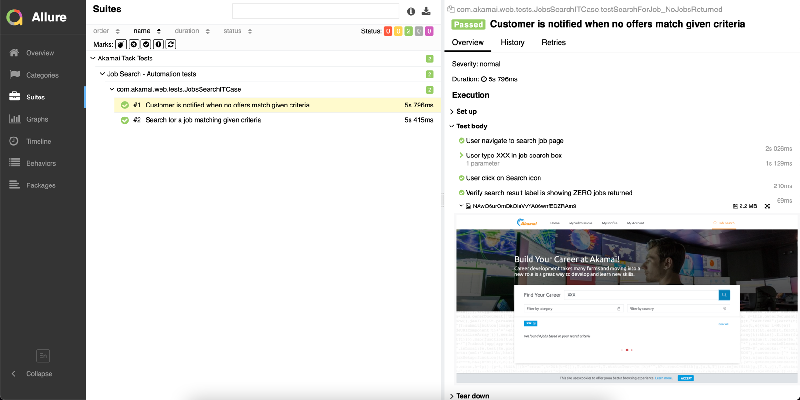

# AKA Web Task


“Please write automated tests using Selenium WebDriver and using testNG or jUnit for given test scenarios:

1. Feature: Unlogged customer is able to search for a job. 


    Scenario: Search for a job matching given criteria
    Given Customer is on "https://akamaicareers.inflightcloud.com/"
    When Customer specifies “Find Your Career”: Senior Software Development Engineer in Test
    And "Filter by country": Poland
    Then Any job offers are found

2. Feature: Customer is notified when no offers match given criteria


    Scenario: Search for a job matching given criteria
    Given Customer is on "https://akamaicareers.inflightcloud.com/"
    When Customer specifies “Find Your Career”: XXX
    Then Notification about no offers found is displayed: "We found 0 jobs based on your search criteria"


_**The exercise consists of:**_

- creating a new project in a public repository, like GitHub
- choosing tools / libraries needed for writing the tests. Required are java 8+, Selenium WebDriver, and maven. All the rest can be used freely
- creating a Test Automation Framework that allows executing the steps needed to perform the tests
- writing Automated tests covering provided Test scenarios "

### Assumptions

- Assume that the framework is configured to use Only Chrome browser.
- Assume that Screenshot will be taken on Both succeed/failed tests.

## Stack & Libraries
- Java 11+
- Selenium
- Selenium WebDriverManager
- TestNG
- Maven
- Allure report

## Prerequisites
- Maven configuration
- Allure configuration

## How to run
In terminal:
```
git clone https://github.com/mbilbiesi/aka-task.git
```
Change directory to the location of cloned project folder and run Maven clean
```
mvn clean
```
To run the test
```
mvn verify
```

To generate the report
```
mvn allure:serve
```

## Report Sample
  